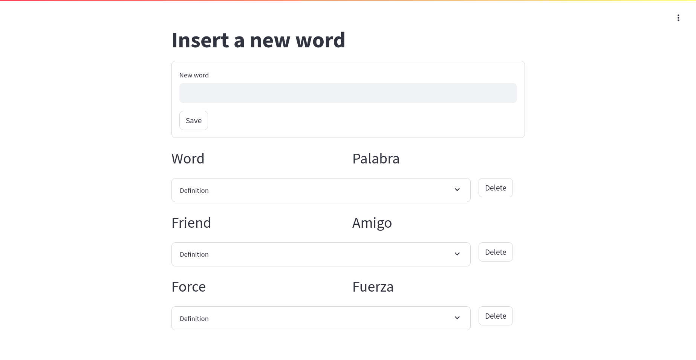
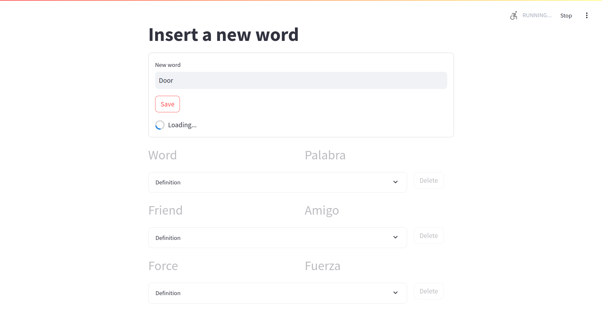
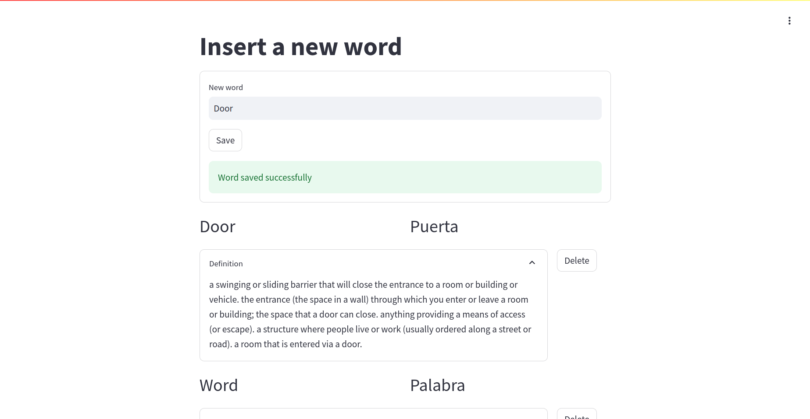

# Vocabulary App
[https://vocabulary-app-c1cs.onrender.com/](https://vocabulary-app-c1cs.onrender.com/)
An application to keep track of vocabulary. This app uses Streamlit for the interface and NLTK and deep_translator for translations.

 
The user can register new words.
 
 

 
Once the "save" button is pressed, the word will be automatically saved, translated, and a description will be added.
 
 

